# FX Trading App Backend

A production-ready backend system for an FX Trading Application built with NestJS, TypeORM, and PostgreSQL. Users can register, verify their email, manage multi-currency wallets, and trade currencies using real-time exchange rates.

## 🚀 Features

- **User Authentication**
  - Email-based registration with OTP verification
  - JWT authentication
  - Secure password hashing with bcrypt

- **Multi-Currency Wallet**
  - Support for multiple currencies (NGN, USD, EUR, GBP, JPY, CAD, AUD, CHF)
  - Atomic wallet operations with ACID compliance
  - Pessimistic locking to prevent race conditions
  - Double-spending prevention

- **Real-Time FX Rates**
  - Integration with ExchangeRate-API
  - In-memory caching (5-minute TTL)
  - Graceful fallback on API failures
  - Support for all major currency pairs

- **Currency Trading**
  - Convert between any supported currencies
  - Real-time exchange rate application
  - Atomic balance updates
  - Comprehensive transaction logging

- **Transaction History**
  - Complete audit trail
  - Filtering by type, status, and date range
  - Pagination support

## 📋 Prerequisites

- Node.js (v16 or higher)
- PostgreSQL (v12 or higher)
- npm or yarn
- ExchangeRate-API key (free tier available at https://www.exchangerate-api.com/)
- Gmail account for SMTP (or alternative email service)

## 🛠️ Installation

### 1. Clone the repository

```bash
cd trading-app
```

### 2. Install dependencies

```bash
npm install
```

### 3. Set up PostgreSQL database

Create a new PostgreSQL database:

```sql
CREATE DATABASE fx_trading_db;
```

### 4. Configure environment variables

Copy the example environment file:

```bash
copy .env.example .env
```

Edit `.env` and update the following variables:

```env
# Database Configuration
DATABASE_HOST=localhost
DATABASE_PORT=5432
DATABASE_USERNAME=postgres
DATABASE_PASSWORD=your_password
DATABASE_NAME=fx_trading_db

# JWT Configuration
JWT_SECRET=your-super-secret-jwt-key-change-this-in-production
JWT_EXPIRATION=7d

# Email Configuration (PLUNK EMAIL)
PLUNK_API_KEY=your_plunk_key

# FX Rate API
FX_API_URL=https://v6.exchangerate-api.com/v6

# Application
PORT=3000
NODE_ENV=development
```

**Important Notes:**
- Get your free Plunk key at: https://www.useplunk.com/
- Get your free ExchangeRate-API key at: https://www.exchangerate-api.com/

### 5. Run the application

```bash
# Development mode
npm run start:dev

# Production mode
npm run build
npm run start:prod
```

The application will be available at:
- **API**: http://localhost:3000
- **Swagger Documentation**: http://localhost:3000/api/docs
- **Postman Documentation**: https://documenter.getpostman.com/view/18641174/2sBXc8nhk4

## 📚 API Documentation

For complete API documentation with examples, visit the [Postman Documentation](https://documenter.getpostman.com/view/18641174/2sBXc8nhk4).

### Authentication Endpoints

#### Register User
```http
POST /auth/register
Content-Type: application/json

{
  "email": "user@example.com",
  "password": "SecurePass123!"
}
```

#### Verify Email
```http
POST /auth/verify
Content-Type: application/json

{
  "email": "user@example.com",
  "otp": "123456"
}
```

#### Login
```http
POST /auth/login
Content-Type: application/json

{
  "email": "user@example.com",
  "password": "SecurePass123!"
}
```

### Wallet Endpoints (Requires Authentication)

#### Get Wallet
```http
GET /wallet
Authorization: Bearer <token>
```

#### Fund Wallet
```http
POST /wallet/fund
Authorization: Bearer <token>
Content-Type: application/json

{
  "currency": "NGN",
  "amount": 10000
}
```

#### Convert Currency
```http
POST /wallet/convert
Authorization: Bearer <token>
Content-Type: application/json

{
  "fromCurrency": "NGN",
  "toCurrency": "USD",
  "amount": 1000
}
```

### FX Rates Endpoints

#### Get All Currency Pairs with Rates
```http
GET /fx/pairs
```

Returns exchange rates for all supported currency pairs in both directions.

### Currency Management Endpoints (Admin Only)

#### Get All Currencies
```http
GET /currencies
Authorization: Bearer <admin-token>
```

#### Add New Currency
```http
POST /currencies
Authorization: Bearer <admin-token>
Content-Type: application/json

{
  "code": "ZAR",
  "name": "South African Rand",
  "symbol": "R",
  "isActive": true
}
```

#### Activate/Deactivate Currency
```http
PATCH /currencies/:id
Authorization: Bearer <admin-token>
Content-Type: application/json

{
  "isActive": false
}
```

### Transaction Endpoints (Requires Authentication)

#### Get Transaction History
```http
GET /transactions?type=CONVERSION&status=COMPLETED&page=1&limit=20
Authorization: Bearer <token>
```

Query Parameters:
- `type`: FUNDING, CONVERSION
- `status`: PENDING, COMPLETED, FAILED
- `startDate`: ISO date string
- `endDate`: ISO date string
- `page`: Page number (default: 1)
- `limit`: Items per page (default: 20)

## 📊 System Architecture & Flow Diagrams

### High-Level System Architecture


### Currency Conversion Flow

```mermaid
sequenceDiagram
    participant User
    participant API
    participant WalletService
    participant FXService
    participant Database
    participant ExchangeAPI

    User->>API: POST /wallet/convert
    API->>API: Authenticate User
    API->>WalletService: convertCurrency()
    
    WalletService->>Database: Start Transaction
    WalletService->>Database: Get Wallet (Lock)
    
    WalletService->>FXService: getRate(from, to)
    FXService->>FXService: Check Cache
    alt Cache Hit
        FXService-->>WalletService: Return Cached Rate
    else Cache Miss
        FXService->>ExchangeAPI: Fetch Rate
        ExchangeAPI-->>FXService: Exchange Rate
        FXService->>FXService: Cache Rate (5 min)
        FXService-->>WalletService: Return Rate
    end
    
    WalletService->>Database: Get Source Balance (Lock)
    WalletService->>WalletService: Validate Sufficient Funds
    WalletService->>Database: Get/Create Target Balance (Lock)
    
    WalletService->>WalletService: Calculate Conversion<br/>(amount × rate)
    WalletService->>Database: Update Source Balance
    WalletService->>Database: Update Target Balance
    WalletService->>Database: Create Transaction Record
    
    WalletService->>Database: Commit Transaction
    WalletService-->>API: Conversion Result
    API-->>User: Success Response
```



### Wallet Funding Flow (Webhook-Based)


### User Registration & Verification Flow


### Database Entity Relationship Diagram


## 🏗️ Architecture & Design Decisions

### Multi-Currency Wallet Design

The system uses a **separate Balance table** approach:
- Each user has one `Wallet`
- Each wallet can have multiple `Balance` records (one per currency)
- Provides type safety, atomic updates, and easy scalability

### Transaction Safety

All wallet operations use:
- **Database transactions** for atomicity
- **Pessimistic locking** (`FOR UPDATE`) to prevent race conditions
- **Comprehensive validation** to prevent double-spending
- **Transaction logging** for complete audit trail

### FX Rate Management

- **In-memory caching** with 5-minute TTL
- **Graceful fallback** to expired cache on API failures
- **Retry logic** for transient errors
- **Rate limiting** awareness

### Database Schema

```
users
├── id (uuid, PK)
├── email (unique)
├── password (hashed)
├── isVerified (boolean)
├── otp (nullable)
├── otpExpiry (timestamp)
├── createdAt
└── updatedAt

wallets
├── id (uuid, PK)
├── userId (FK -> users.id)
├── createdAt
└── updatedAt

balances
├── id (uuid, PK)
├── walletId (FK -> wallets.id)
├── currency (enum)
├── amount (decimal 18,8)
├── updatedAt
└── UNIQUE(walletId, currency)

transactions
├── id (uuid, PK)
├── userId (FK -> users.id)
├── type (enum: FUNDING, CONVERSION, TRADE)
├── fromCurrency (enum, nullable)
├── toCurrency (enum, nullable)
├── fromAmount (decimal, nullable)
├── toAmount (decimal, nullable)
├── exchangeRate (decimal, nullable)
├── status (enum: PENDING, COMPLETED, FAILED)
├── metadata (jsonb)
└── createdAt
```

## 🔒 Security Features

- **Password hashing** with bcrypt (10 rounds)
- **JWT authentication** with configurable expiration
- **Email verification** required for trading
- **Input validation** on all endpoints
- **SQL injection prevention** via TypeORM parameterized queries
- **CORS enabled** for cross-origin requests
- **Rate limiting** awareness for external APIs

## 🧪 Testing

### Manual Testing Flow

1. **Register a user**
   ```bash
   curl -X POST http://localhost:3000/auth/register \
     -H "Content-Type: application/json" \
     -d '{"email":"test@example.com","password":"Test123!"}'
   ```

2. **Check email for OTP** (6-digit code)

3. **Verify email**
   ```bash
   curl -X POST http://localhost:3000/auth/verify \
     -H "Content-Type: application/json" \
     -d '{"email":"test@example.com","otp":"123456"}'
   ```

4. **Login to get JWT token**
   ```bash
   curl -X POST http://localhost:3000/auth/login \
     -H "Content-Type: application/json" \
     -d '{"email":"test@example.com","password":"Test123!"}'
   ```

5. **Fund wallet**
   ```bash
   curl -X POST http://localhost:3000/wallet/fund \
     -H "Authorization: Bearer <token>" \
     -H "Content-Type: application/json" \
     -d '{"currency":"NGN","amount":50000}'
   ```

6. **Convert currency**
   ```bash
   curl -X POST http://localhost:3000/wallet/convert \
     -H "Authorization: Bearer <token>" \
     -H "Content-Type: application/json" \
     -d '{"fromCurrency":"NGN","toCurrency":"USD","amount":10000}'
   ```

7. **View transaction history**
   ```bash
   curl -X GET http://localhost:3000/transactions \
     -H "Authorization: Bearer <token>"
   ```

## 📦 Project Structure

```
src/
├── auth/                    # Authentication module
│   ├── dto/                # Data transfer objects
│   ├── guards/             # JWT and verification guards
│   ├── strategies/         # Passport JWT strategy
│   ├── auth.controller.ts
│   ├── auth.service.ts
│   └── auth.module.ts
├── users/                   # User module
│   ├── entities/
│   │   └── user.entity.ts
│   └── users.module.ts
├── wallets/                 # Wallet module
│   ├── dto/
│   ├── entities/
│   │   ├── wallet.entity.ts
│   │   └── balance.entity.ts
│   ├── wallets.controller.ts
│   ├── wallets.service.ts
│   └── wallets.module.ts
├── fx-rates/                # FX rates module
│   ├── fx-rates.controller.ts
│   ├── fx-rates.service.ts
│   └── fx-rates.module.ts
├── transactions/            # Transaction history module
│   ├── dto/
│   ├── entities/
│   │   └── transaction.entity.ts
│   ├── transactions.controller.ts
│   ├── transactions.service.ts
│   └── transactions.module.ts
├── common/                  # Shared resources
│   ├── decorators/
│   ├── enums/
│   ├── filters/
│   └── services/
├── app.module.ts
└── main.ts
```

## 🔧 Key Assumptions

1. **Wallet Funding**: The fund wallet endpoint assumes integration with a payment platform (e.g., Paystack, Flutterwave, Stripe). When a customer makes a payment, the payment platform sends a webhook to our system, which triggers the wallet funding for the specific currency. For production scalability, these webhook events should be pushed to a message queue (e.g., RabbitMQ, AWS SQS, Redis Queue) for asynchronous processing to handle high volumes and ensure reliability.

2. **Currency Conversion**: The conversion process applies **no additional fees or spreads**. Users receive the exact exchange rate from the FX API without any markup. This provides transparent, fee-free currency swaps.

3. **Currency Management**: The system allows administrators to:
   - Add new currencies to the platform
   - Activate currencies for trading
   - Deactivate currencies when needed
   - All currency operations are managed through the admin endpoints

4. **Email Service**: Plunk is used for transactional emails (OTP verification). For production, ensure you have a valid Plunk API key.

5. **FX Rate API**: Using ExchangeRate-API free tier (1,500 requests/month). For production with high traffic, upgrade to a paid plan or use alternative providers.

6. **Database**: PostgreSQL is used for its robust ACID compliance and excellent support for concurrent transactions.

7. **OTP Expiry**: OTP codes expire after 10 minutes.

8. **Cache TTL**: FX rates are cached for 5 minutes to balance freshness with API rate limits.

9. **Synchronize**: TypeORM `synchronize` is enabled in development for automatic schema updates. **Disable in production** and use migrations.


### Environment Variables for Production

Ensure all sensitive values are properly secured:
- Use environment-specific `.env` files
- Never commit `.env` to version control
- Use secret management services (AWS Secrets Manager, HashiCorp Vault)

## 🤝 Contributing

This is an assessment project. For production use, consider:
- Adding idempotency keys for transactions
- Implementing webhook notifications
- Adding analytics and reporting features

## 📄 License

This project is created for assessment purposes.

## 👤 Author

Obinna Emmanuel Edmund - FX Trading App

---

**Need Help?**
- Check the Swagger documentation at `/api/docs`
- Review the implementation plan in the project repository
- Ensure PostgreSQL is running and accessible
- Verify all environment variables are correctly set
